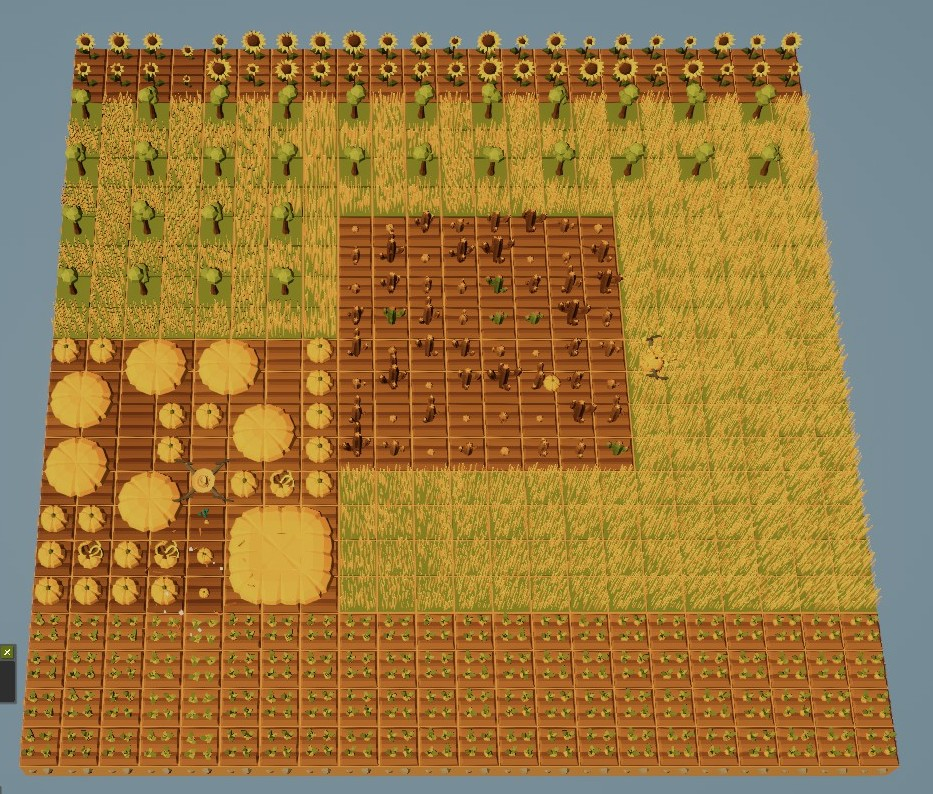

# The Farmer was Replaced()



ぱいそん農家。

`農家は Replaced() されました` というゲームで使用するPythonコードを管理します。

https://store.steampowered.com/app/2060160

### ファイルのありか

```plain
C:\Users\[user_name]\AppData\LocalLow\TheFarmerWasReplaced\TheFarmerWasReplaced
```
